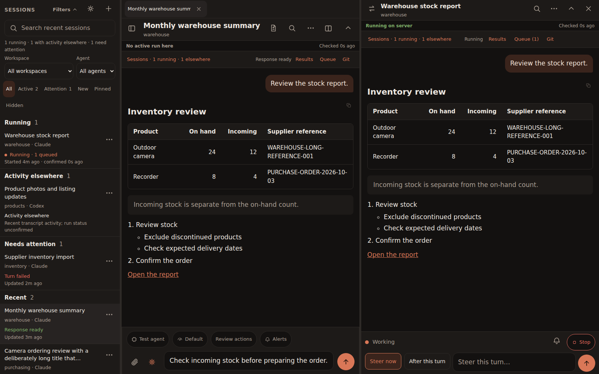
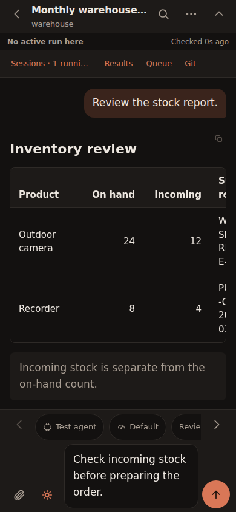

# Pocket Code

**Your Claude Code and Codex sessions on desktop, tablet and phone.**

Pocket Code is a self-hosted workspace for running and following coding-agent sessions.
Use tabs and split conversations at your desk, then continue from your phone. The
server owns the work: closing the browser or locking the screen does not stop a turn.

This checkout documents **1.31.0 / build 72**. See the [changelog](CHANGELOG.md) for
release status and [GitHub Releases](https://github.com/bbesner/pocket-code/releases)
for published versions. An unreleased changelog entry is a candidate, not a release.



Screenshots use synthetic demo sessions, not private conversations.

## What you can do

- **Work across sessions.** Search and filter the session list, pin or rename work,
  keep open-session tabs, and resume the last conversation on this browser.
- **Track projects (optional).** Turn on Projects in Settings → Tools to keep a card for
  each piece of work: where you left off, the next step, remaining steps, reminders and
  the sessions that worked on it. Projects open as a tab, beside a conversation, or
  full-screen on the phone; a Scheduled view lists every reminder, due first; agents keep
  cards current with `pocket-board`. See the [workspace guide](docs/workspace-guide.md#projects).
- **Keep documents (optional).** Turn on Documents in Settings → Tools for a library of the
  files that came out of the work. HTML renders sandboxed; PDFs, images, Markdown and CSV
  render natively; share a document privately, by link or publicly, all served by Pocket.
  Keep a file from a session's Results, upload one, or let agents keep deliverables with
  `pocket-docs`. See the [workspace guide](docs/workspace-guide.md#documents).
- **Use a desktop workspace.** Open up to four conversations side by side when space
  permits, start a new session in a pane, swap it with the main conversation, and resize
  dividers. Results, Queue and read-only Git inspection can stay in a side panel.
- **Keep working away from the desk.** Install the PWA on a phone or tablet. Collapse
  header and message settings independently; drafts and attachments survive reloads.
- **Guide a running agent.** Steer the active turn or save a separate follow-up with
  After this turn. Edit, cancel or run paused instructions from Queue.
- **Review the output.** Read streamed reports, tables, code, images and task checklists;
  find text across a conversation; copy messages or code; open linked results. Each
  message shows its time and a divider marks each day (Settings → Show message times).
- **Answer and approve.** Native agent questions and action approval cards appear in
  the session. Choose Review actions or Full access for subsequent turns.
- **Reply with a tap.** When a reply ends by asking you to choose a next step ("Should I
  merge and deploy?"), the options appear as buttons under it. A tap sends that option;
  the X hides them so you can type your own answer.
- **Choose how to run.** Set the model and reasoning effort per turn, use Codex's
  Plan first mode, or start from an installed skill and a project directory.
- **See status and limits.** Distinguish confirmed server work from activity elsewhere,
  watch the context ring beside the composer fill (hover for tokens, click for the session's usage and
  plan limits), see how long a Claude session's prompt cache stays warm, inspect this instance's accounts, and switch its Claude Code login.
- **Get completion alerts.** Enable optional push notifications, an on-screen chime,
  or per-session muting. Push requires HTTPS, server keys and browser permission.
- **Talk to a session (beta, optional).** Tap the mic beside Send and speak; a short summary of
  the reply is read back. Speech is processed on your own server. See [Voice mode](#voice-mode-beta).

[Workspace guide](docs/workspace-guide.md) · [Operations and upgrades](docs/operations.md)
· [Action approvals](docs/action-approvals.md) · [Contributing and releases](CONTRIBUTING.md)

## Desktop and mobile

On desktop, the session rail, tabs, split panes and workspace panel provide separate
places for finding work, reading conversations and inspecting results. Panes that
no longer fit hide in place and return when the window widens. Their drafts and
server processes remain intact.

On phones, the same tools open as sheets. Common session filters remain visible;
additional filters collapse with an applied-filter summary. Scroll buttons expose
message settings that do not fit. The paperclip and Send remain beside the draft.



| Action | What happens to the server session? |
|---|---|
| Close a browser, tab, or existing-session side pane | Work keeps running. |
| A pane hides because the window is too narrow | Its frame, draft and session are retained. |
| Session options → Close session process | Releases an idle process. If work is active, choose Keep running or Stop. |
| Stop in the composer | Interrupts the active turn; pending follow-ups pause. |

Closing an unstarted **New session** side pane removes that pane's unsent draft,
attachments and saved start state. Closing any view does not delete conversation history.

## How sessions work

Pocket drives the installed `claude` and `codex` CLIs. Claude transcripts and Codex's
native session store remain the conversation record; Pocket does not maintain a
separate chat database. Pocket does keep its own settings, delivery receipts, queues,
usage snapshots and runner metadata.

Since 1.7, each Claude session keeps a CLI process between turns, and each Codex
thread keeps an app-server process. Working context, MCP connections and reported
background work can continue between messages. Replies stream to open browsers.
Claude background-job completion can start an agent follow-up without another message.

Idle processes normally close after 60 minutes; the next message resumes the saved
conversation. There is no fixed two-hour turn limit. A separate 30-minute stall
watchdog checks output, pending input and activity from programs started by the turn.
Reported Claude background jobs also prevent idle closure and stall termination.
Operators can change these timings. See [lifecycle and recovery](docs/operations.md).

**Codex's writer lock stays held while Pocket keeps a thread open.** Release its
session process in Pocket before continuing that thread in code-server. Avoid sending
to one conversation from two applications at the same time. Pocket also mirrors
external transcript activity, but recent writes alone cannot prove that work is still running.

Both providers can survive a Pocket daemon restart when started with the supplied
PM2 configuration. This is daemon restart recovery, not host-reboot survival. Pending
native questions and approvals are denied on adoption so the agent can ask again;
an input connection that cannot be recovered is shown as interrupted.

## Requirements

- Linux with Claude Code installed and signed in; Codex is optional.
- Node.js 20.11 or newer for the server; Node.js 22.12+ and Chrome/Chromium for tests.
- PM2 using the supplied `ecosystem.config.cjs`, or a supervisor configured to preserve
  child session processes during a daemon restart.
- HTTPS through a tunnel or reverse proxy for secure login, installation and push.
- The daemon plus capacity for CLI and MCP processes. One Pocket process does not mean
  the whole installation uses only one OS process.

## Quick start

```bash
git clone https://github.com/bbesner/pocket-code.git ~/pocket-code
cd ~/pocket-code
npm ci --omit=dev

# 1. Configure: password, cookie secret and push keys
PW=$(openssl rand -base64 18)
KEYS=$(npx web-push generate-vapid-keys --json)
cat > .env <<EOF
PORT=3610
POCKET_PASSWORD=$PW
POCKET_SECRET=$(openssl rand -hex 32)
VAPID_PUBLIC=$(echo "$KEYS" | node -pe 'JSON.parse(require("fs").readFileSync(0)).publicKey')
VAPID_PRIVATE=$(echo "$KEYS" | node -pe 'JSON.parse(require("fs").readFileSync(0)).privateKey')
VAPID_CONTACT=you@example.com
EOF
chmod 600 .env
echo "Your Pocket Code password: $PW"

# 2. Run it (always start from the ecosystem file; see "Operating notes")
pm2 start ecosystem.config.cjs
pm2 save

# 3. Check it's up
curl -s localhost:3610/api/health        # {"ok":true,...}
```

Next, give it an HTTPS address. With a Cloudflare Tunnel, add an ingress rule ahead of
the catch-all in `~/.cloudflared/config.yml`, route the DNS name to the tunnel and
restart `cloudflared`:

```yaml
- hostname: code.yourdomain.com
  service: http://localhost:3610
```

On your phone, open the address, sign in and choose **Add to Home screen**. Then tap
the bell icon to turn on notifications.

## Configuration

Server configuration comes from the process environment or `.env` (see [`.env.example`](.env.example)). Existing environment values take precedence over that file. Browser preferences such as drafts, tabs, filters and text size stay on each device.

| Variable | Required | What it does |
|---|---|---|
| `POCKET_PASSWORD` | yes | Login password. Make it long and random. |
| `POCKET_SECRET` | yes | Secret used to sign the login cookie (`openssl rand -hex 32`). |
| `PORT` | no | Local port. Default `3610`. The server only listens on `127.0.0.1`. |
| `VAPID_PUBLIC`, `VAPID_PRIVATE` | for push | Web-push keys. Without them, push is off. |
| `VAPID_CONTACT` | for push | Your email or an https URL, given to push services as the operator contact. |
| `CLAUDE_BIN` | no | Path to `claude`, if it isn't found automatically. |
| `POCKET_CODEX` | no | Set to `0` to hide Codex sessions even when `codex` is installed. |
| `POCKET_CHOICES` | no | Set to `0` to stop asking agents for reply suggestions (the buttons under a closing question). |
| `POCKET_AUTO_TITLES` | no | Starting value for **Settings → Generate short titles** (on unless `0`). Titles are made for sessions named only by their first message, with the signed-in Claude CLI (Haiku, about 400 tokens each) or Codex (GPT-6-Luna, about 25k tokens each), on that CLI's own account: your subscription, or an API key if that is how the CLI is signed in. After the first change in Settings, the Settings value wins. |
| `POCKET_TITLE_CLAUDE_MODEL`, `POCKET_TITLE_CODEX_MODEL` | no | Models for generated titles. Defaults `haiku` (the Claude CLI's newest Haiku) and `gpt-6-luna`. |
| `POCKET_LIVE_TITLE_GAP_MS` | no | Minimum time between two title checks on one session (**Settings → Update titles as sessions progress**). Default ten minutes. |
| `POCKET_MEMSTEM_URL` | no | MemStem daemon for searching inside conversations. Default `http://127.0.0.1:7821`; without a healthy MemStem, Pocket searches recent conversations itself. `POCKET_MEMSTEM=0` turns MemStem search off. |
| `CODEX_BIN`, `CODEX_HOME` | no | Path to `codex` and its home directory, if not the defaults. |
| `POCKET_RETRY_BUFFER_MS` | no | Wait after a usage-limit reset before auto-continuing. Default 5 minutes. |
| `POCKET_CLAUDE_MODEL`, `POCKET_CLAUDE_EFFORT` | no | Pocket-only Claude default for turns left on Default, e.g. `claude-opus-5-5[1m]` and `high`. Model must be one of the picker ids. |
| `POCKET_CODEX_MODEL`, `POCKET_CODEX_EFFORT` | no | Pocket-only Codex default, e.g. `gpt-6-sol` and `medium`. |
| `POCKET_DEFAULT_CWD` | no | Workspace the New session screen preselects, e.g. your home directory. Default: wherever you last started a session. |
| `POCKET_IDLE_CLOSE_MS` | no | How long a session's process (Claude Code or Codex) stays up with no turn and no background job, in milliseconds. Default `3600000` (1 hour); `0` keeps processes until Pocket closes them for another reason. |
| `POCKET_STALL_MS` | no | A turn with no output, no background job, nothing waiting on you and no CPU use by programs it started for this long is stopped. Milliseconds; default `1800000` (30 minutes); `0` disables the watchdog. A value that is not a number is logged and ignored. |
| `POCKET_MAX_PROCESSES` | no | Soft target for live CLI processes (Claude Code and Codex together) kept at once. Starting one past the cap closes the longest-idle process that has no turn and no background job. Default `8`; `0` means no cap. Active work is never evicted to meet this target, so the count can exceed it. CLI and MCP processes add memory beyond the Pocket daemon. |
| `POCKET_APPROVAL_MODE` | no | Default permissions for new turns: `review` (default) or `full`. |
| `POCKET_ALLOW_FULL_ACCESS` | no | Set to `0` to reject Full access in both API and UI. |
| `POCKET_DATA_DIR` | no | Pocket state and runner files; defaults to the checkout. Move only after all session processes are closed. |
| `POCKET_SESSION_ROOT` | no | Override Claude transcript storage for isolated tests; does not relocate Codex. |
| `POCKET_REMINDER_HOOK` | no | A command run when a project reminder comes due (Projects, 1.29), with the reminder as JSON on its standard input: `project`, `projectName`, `reminder`, `label`, `dueAt`, `task`, `taskText`, `url`. Each reminder is announced once. Use it for email, chat or anything else; web push happens regardless. |
| `POCKET_DOCUMENTS_DIR` | no | Where Documents (1.30) keeps files. Default `<data dir>/documents`. Files placed there appear as private documents; removed documents wait in its `.trash` for 30 days. |
| `POCKET_TZ` | no | Time zone for `pocket-board` times given without an offset, e.g. `America/New_York`. Default: the server's zone. |
| `POCKET_FRAME_ANCESTORS` | no | Origins allowed to embed Pocket Code in a frame (for example Mission Control), space-separated. Default: only Pocket's own origin. |
| `POCKET_VOICE` | no | Set to `off` to disable voice mode even when it is installed. |
| `POCKET_VOICE_HOME` | no | Where `scripts/voice-setup.sh` installed the voice engine. Default `~/.local/share/pocket-code/voice`. |
| `POCKET_VOICE_IDLE_MS` | no | How long the voice engine stays loaded after its last use, in milliseconds. Default `900000` (15 minutes). |
| `POCKET_ENV_FILE` | no | Read settings from this file instead of `.env` next to the server; empty means read none (the test suite sets it). |

Turns use your global CLI settings (`~/.claude/settings.json`, Codex config), such as
the default model, effort and hooks, unless you override them per turn in the composer.
The `POCKET_*_MODEL`/`_EFFORT` variables change the default for Pocket turns only; your
terminal and editor sessions keep the CLI settings. Hooks and instructions still apply.

## Security and approvals

Pocket Code runs as your server's OS user. **Anyone who can sign in can authorize
commands with that user's access.** Review actions is the default, while an operator
can enable or disallow Full access. These modes are execution controls, not employee
accounts or an isolation boundary. Changing the mode affects subsequent turns;
steering does not change permissions on an already-running turn.

The app binds to loopback, uses a signed secure cookie and login rate limiting, and
sends a same-origin Content Security Policy. Allow embedding origins explicitly with
`POCKET_FRAME_ANCESTORS`. Keep `.env`, private state and transcripts out of version control.
Use an additional identity layer in front when appropriate for your installation.
Read the [security model](SECURITY.md) and [approval/recovery behavior](docs/action-approvals.md).

## Operating and upgrading

Use the ecosystem file when starting or restarting PM2. Its `treekill: false` setting
preserves detached session processes so the new daemon can reattach. The PM2 process
is still called `pocket-claude` for compatibility with existing installations.

Upgrade to a reviewed release, preserve configuration and runtime state, install the
lockfile's dependencies, restart from the ecosystem file, then verify the server and
browser build. Do not restore an old state snapshot over newer queues or receipts.
Before moving data, uninstalling, or downgrading below 1.7, close **all session processes**,
including idle Codex app-servers. The [operations guide](docs/operations.md) gives the
state inventory, health checks, upgrade steps and rollback requirements.

## Voice mode (beta)

Voice mode is optional and in beta: it works, and its behavior is still being tuned from real use.
It lets you speak to a session and hear its reply read aloud, as briefly or fully as you choose.
Speech-to-text ([faster-whisper](https://github.com/SYSTRAN/faster-whisper), `small.en`) and
text-to-speech ([Kokoro](https://github.com/thewh1teagle/kokoro-onnx)) run in a local process on
the Pocket server. No audio or text goes to a speech service, and there are no per-use fees.

```bash
bash scripts/voice-setup.sh   # Python 3 venv + models, about 1.3 GB; then restart Pocket Code
```

The engine starts the first time someone uses the mic (a few seconds) and stops after 15 idle
minutes. While loaded it uses about 1 GB of RAM and a few CPU cores per request; no GPU is needed.
On a 16-vCPU server a spoken command took about 1 second to transcribe, and the first sentence of
a reply was ready in under a second. Without the install, the mic button stays hidden.

- **Tap** the mic and speak; it sends when you pause. **Hold** it for push-to-talk. The mic sends one
  message and does not listen again.
- **Hands-free:** tap the headset beside the mic. Each reply is read aloud and the mic listens for your
  answer (up to 2 minutes by default) until you tap the headset again, tap Cancel or stay quiet. It is
  never on unless you start it, and it hides while you have a typed draft. Each instruction is read back
  and sent only after you say "send it" or tap Send.
- Short commands are answered without the agent: *what's it doing*, *stop*, *read it*,
  *read it all* and *what's waiting on me*. Anything else is sent as a normal message.
- Settings → Voice: speak replies, spoken reply length (Brief: one sentence; Normal: about two;
  Detailed: the whole reply without code, tables or links), review before sending, how long hands-free
  waits for your reply, voice and names to recognize. Approvals still need a tap.
- **Spoken alerts.** Settings → Voice → Announce sessions says when any session finishes ("The SCK
  inventory session finished", optionally with a one-line summary) or needs your approval or answer,
  in place of the chime, while Pocket is open. Muted sessions stay quiet; push covers a closed app.
  Announcements never turn the microphone on, even during a hands-free conversation.

Browsers allow the microphone only over HTTPS. An embedding page must grant the frame
`allow="microphone"`. Details: [workspace guide](docs/workspace-guide.md#voice-mode-beta) and
[operations](docs/operations.md#voice-engine).

## Optional MemStem integration

Agent turns use the CLI's configured instructions, skills, hooks and MCP servers.
If you already use [MemStem](https://github.com/Memstem/memstem), its shared memory is
available through those agents just as it is from the terminal or editor. Pocket Code
does not require MemStem and does not configure it for you.

## Development

```bash
npm ci
npm run check:release
npm test
PUPPETEER_EXECUTABLE_PATH=/path/to/chrome npm run test:browser
```

Tests use temporary stores, fake provider CLIs and synthetic browser sessions. They
require no model credentials. The browser suite covers responsive layouts, delivery
recovery, questions/approvals, split panes, keyboard behavior and axe accessibility
checks. Physical-device input, real screen readers and OS push delivery still need
manual validation.

[CONTRIBUTING.md](CONTRIBUTING.md) explains local development, CI, screenshot capture,
version consistency and release gates. Historical implementation plans are references;
the workspace and operations guides describe current behavior.

## Bugs and feature requests

Pocket Code is developed in the open. Report bugs and ask for features in
[GitHub Issues](https://github.com/bbesner/pocket-code/issues); the issue forms ask for
the details that make a report actionable. **Settings → Bugs & feature requests** in the
app opens the same forms with your version and build already filled in.

Security problems go through **Security → Report a vulnerability** on the repository, not
a public issue. See [SECURITY.md](SECURITY.md).

## License

Pocket Code is MIT licensed. See [LICENSE](LICENSE). It is an independent project,
unaffiliated with Anthropic or OpenAI. Claude and Claude Code are trademarks of
Anthropic; Codex is a trademark of OpenAI.

### Subagent activity

When a session delegates work, a **Subagents** button shows how many agents are
working. Tap it, then expand an agent to read its task, status and latest activity.
Completed results remain available. **Session options → Subagents** opens the same
view, including when no agents have been recorded yet.

The view refreshes every five seconds while visible. It reads Claude and Codex
records without starting another agent. Background shell jobs are excluded.
Activity outside Pocket, interrupted connections and missing completion records
can show **Status unconfirmed**. Older providers may supply fewer details.

[Phone preview](docs/images/subagents-mobile.png) · [Desktop preview](docs/images/subagents-desktop.png) (synthetic demo data).
