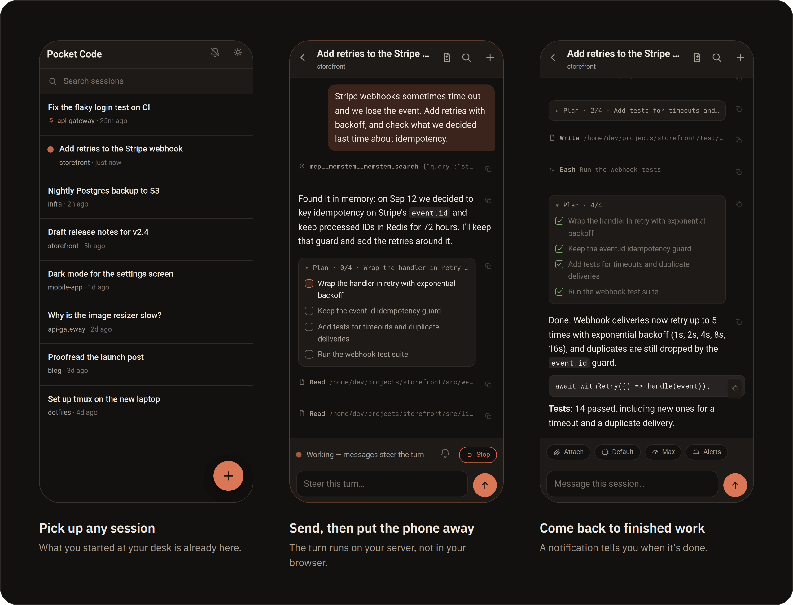
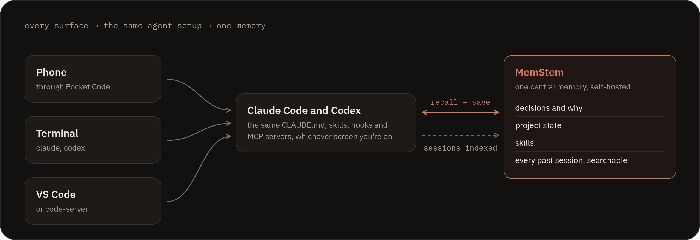
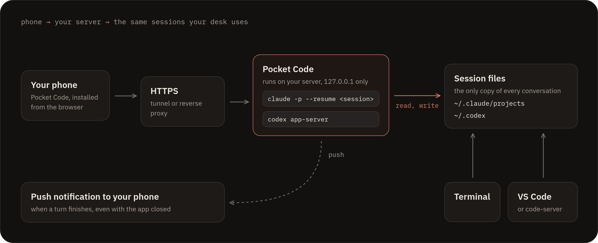
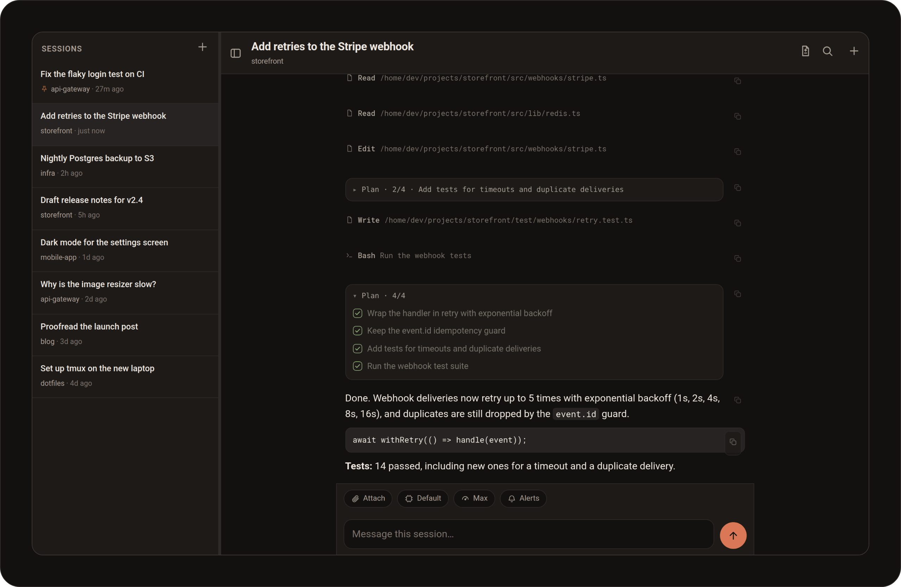

# Pocket Code

**Your Claude Code and Codex sessions, from your phone.**



Pocket Code is a small, self-hosted web app for coding with AI agents while you're away
from your desk. Open it on your phone, pick up any session you started in the terminal
or in VS Code / code-server, send the next instruction, and put the phone away. The work
runs on your server, not in your browser, so it keeps going when the screen goes dark.
When the turn finishes, you get a notification.

There's no new agent to learn, no sync service and no separate history. Pocket Code
drives the real `claude` and `codex` CLIs on your machine and reads the same session
files they write. A session you start on the phone is waiting in your terminal when you
sit back down, and the reverse.

- **One server, any screen.** Installable PWA for phone and tablet, with a two-pane
  layout on desktop.
- **Walk-away turns.** A daemon on the server runs every turn headlessly. Close the tab,
  lose signal, lock the phone: the turn still finishes.
- **The same sessions everywhere.** Claude Code transcripts in `~/.claude/projects` and
  Codex threads in `~/.codex` are the only source of truth.
- **Tiny footprint.** One Node process, two dependencies (`express`, `web-push`), no
  build step, no database.

## Works great with MemStem

Pocket Code turns go through your own CLI install, so they use everything that install
is set up with: your `CLAUDE.md` files, skills, hooks, slash commands and **MCP servers**.
That makes it a natural companion to [MemStem](https://github.com/Memstem/memstem), a
self-hosted memory system for AI agents:

- With MemStem connected as an MCP server, the agent answering you on the phone
  searches and updates **the same central memory** as your desktop sessions. Decisions,
  project state and past work follow you, and nothing is siloed on a mobile app.
- Phone turns are written to the normal Claude Code session store, so MemStem's
  session ingestion indexes them like any other session. What you worked out on the
  train is findable from your desk the next morning.



You don't need MemStem to use Pocket Code, but the two work well together: one memory,
every surface.

## How it works



Each message you send starts a detached CLI turn on the server. Output streams to every
open client over server-sent events and lands in the normal transcript. A file watcher
also mirrors sessions you're driving from somewhere else, so the phone shows live
progress for work started in the terminal or code-server.

## Features



**Sessions**
- Grouped sessions and filters for running work, recorded failures and new responses.
  Pocket-owned runs are confirmed; recent activity from terminal/editor sessions is
  labeled separately because transcript writes cannot prove a process is still running.
- A mobile session switcher and searchable desktop rail, with visible session menus.
- Search by title, or across full transcripts.
- Pin and rename sessions, with optional two-way name sync with Claude Code and
  code-server.
- Start a new Claude Code or Codex session in any project directory.

**Chat**
- Word-by-word streaming, with compact lines showing what each tool is doing.
- Per-turn cost and duration, inline images, and a checklist view of the agent's plan.
- **Steer mid-turn:** send a correction while the agent is still working. Messages sent
  while a turn is running are queued.
- A stop button, a changed-files view, find-in-conversation, copy buttons and drafts
  that survive a reload.
- File and photo attachments with thumbnails. Outgoing messages and attachment
  references survive reloads and failed sends; retry uses the same request identifier.
- Slash commands with autocomplete, picked up from your skills and commands.

**Models**
- Per-turn model and reasoning-effort pickers for Claude Code (Fable, Opus, Sonnet,
  Haiku). The Codex model list comes live from your installed CLI.
- When a Claude Code turn hits a usage limit, it continues on its own after the limit
  resets.

**Notifications**
- Push notification when a turn finishes and you're not watching (tested on Android and
  desktop Chrome). Optional chime, and mute per session.

**Housekeeping**
- A settings sheet showing app, CLI and Codex versions, "What's new" after each update,
  and a one-tap update check.

## Requirements

- A Linux server where the **Claude Code CLI** is installed and logged in. The
  **Codex CLI** is optional: Codex sessions appear automatically when `codex` is
  installed.
- **Node.js 20.11 or newer** (tested on Node 22).
- **PM2** or systemd to keep the service running.
- **HTTPS** to reach it. A Cloudflare Tunnel is the easiest option; any reverse proxy
  with TLS works. The PWA install, secure login cookie and push notifications all need
  HTTPS.

## Quick start

```bash
git clone https://github.com/bbesner/pocket-code.git ~/pocket-code
cd ~/pocket-code
npm install --omit=dev

# 1. Configure: password, cookie secret and push keys
PW=$(openssl rand -base64 18)
KEYS=$(npx web-push generate-vapid-keys --json)
cat > .env <<EOF
PORT=3610
POCKET_PASSWORD=$PW
POCKET_SECRET=$(openssl rand -hex 32)
VAPID_PUBLIC=$(echo "$KEYS" | node -pe 'JSON.parse(require("fs").readFileSync(0)).publicKey')
VAPID_PRIVATE=$(echo "$KEYS" | node -pe 'JSON.parse(require("fs").readFileSync(0)).privateKey')
VAPID_CONTACT=you@example.com
EOF
chmod 600 .env
echo "Your Pocket Code password: $PW"

# 2. Run it (always start from the ecosystem file; see "Operating notes")
pm2 start ecosystem.config.cjs
pm2 save

# 3. Check it's up
curl -s localhost:3610/api/health        # {"ok":true,...}
```

Next, give it an HTTPS address. With a Cloudflare Tunnel, add an ingress rule ahead of
the catch-all in `~/.cloudflared/config.yml`, route the DNS name to the tunnel and
restart `cloudflared`:

```yaml
- hostname: code.yourdomain.com
  service: http://localhost:3610
```

On your phone, open the address, sign in and choose **Add to Home screen**. Then tap
the bell icon to turn on notifications.

## Configuration

All settings live in `.env` (see [`.env.example`](.env.example)).

| Variable | Required | What it does |
|---|---|---|
| `POCKET_PASSWORD` | yes | Login password. Make it long and random. |
| `POCKET_SECRET` | yes | Secret used to sign the login cookie (`openssl rand -hex 32`). |
| `PORT` | no | Local port. Default `3610`. The server only listens on `127.0.0.1`. |
| `VAPID_PUBLIC`, `VAPID_PRIVATE` | for push | Web-push keys. Without them, push is off. |
| `VAPID_CONTACT` | for push | Your email or an https URL, given to push services as the operator contact. |
| `CLAUDE_BIN` | no | Path to `claude`, if it isn't found automatically. |
| `POCKET_CODEX` | no | Set to `0` to hide Codex sessions even when `codex` is installed. |
| `CODEX_BIN`, `CODEX_HOME` | no | Path to `codex` and its home directory, if not the defaults. |
| `POCKET_RETRY_BUFFER_MS` | no | Wait after a usage-limit reset before auto-continuing. Default 5 minutes. |

Turns use your global CLI settings (`~/.claude/settings.json`, Codex config), such as
the default model, effort and hooks, unless you override them per turn in the composer.

## Security

> **Pocket Code gives whoever has the password the same power as a shell on your server.**

Turns run unattended, with no one there to approve prompts: Claude Code runs with
`--permission-mode bypassPermissions`, and Codex runs with full access and no approval
prompts. That is what makes walk-away turns possible, and it means the password is the
only thing standing between the internet and your machine. The built-in protections:

- The API listens on `127.0.0.1` only and is reached only through your HTTPS front end.
- Constant-time password check, and a limit of 20 login attempts per hour per IP.
- HMAC-signed, `HttpOnly`, `Secure` session cookie (90 days).

Recommended on top: a long random password, a hostname you don't publish, and an
identity layer such as [Cloudflare Access](https://developers.cloudflare.com/cloudflare-one/policies/access/)
in front for a second factor. Run it on a machine where that trade-off is acceptable.
See [SECURITY.md](SECURITY.md) to report a vulnerability.

## Operating notes

- **Start and restart from `ecosystem.config.cjs`.** It sets PM2's `treekill: false`, so
  turns in progress survive a restart of the service. A restarted server reconnects to
  running Claude Code turns. A Codex turn keeps running too, and its result appears
  when you reopen the session.
- **One live writer per session.** Watching a session from several places is always
  fine. Don't send to the same session from two places at the same moment. Hand off
  instead: finish on one, continue on the other. Codex enforces this. If a thread is
  open for writing in code-server, Pocket Code tells you to close it there first.
- **Data:** transcripts stay where the CLIs keep them. Uploads go to `~/pocket-uploads/`.
  Push subscriptions, pins and mutes are small JSON files next to the server and are
  not tracked by git.
- **Updating:** `git pull && pm2 restart ecosystem.config.cjs`. Browsers pick up the new
  version automatically, and the settings sheet shows what changed.
- **Uninstalling:** `pm2 delete pocket-claude`, then remove the tunnel or proxy route.
  Your sessions are untouched.

The PM2 process is named `pocket-claude`, from before the project was renamed. The name
was kept so existing installs upgrade in place.

## Changelog and license

Release history is in [CHANGELOG.md](CHANGELOG.md). Pocket Code is MIT licensed. See
[LICENSE](LICENSE).

Pocket Code is an independent project and is not affiliated with Anthropic or OpenAI.
Claude and Claude Code are trademarks of Anthropic; Codex is a trademark of OpenAI.

Screenshots in this README show demo projects and sessions.

## Development and releases

See [the session workspace preview](docs/session-workspace.md) and
[the implementation plan](IMPLEMENTATION-PLAN.md) for the staged mobile/desktop
workspace improvements. Version 1.1.0 is the first session-workspace release. Each
release updates `package.json`, `package-lock.json`, the changelog and in-app notes.
Frontend releases also increment the asset number in `public/index.html` and
`public/sw.js`. Create the matching Git tag and GitHub release after validation and
merge; do not tag an unfinished branch.

Development browser tests require Node.js 22.12 or newer and Chrome/Chromium.

```bash
npm ci
npm test
PUPPETEER_EXECUTABLE_PATH=/path/to/chrome npm run test:browser
```

Tests use temporary session stores, a fake CLI and synthetic browser fixtures. They
do not call a model or require production credentials. Browser checks cover 360,
390, 768 and 1440px widths, session filters, keyboard dialogs, saved drafts and
attachments, response-loss retries and stale status. They do not replace physical
phone keyboard, screen-reader or live-provider testing.

`POCKET_DATA_DIR` optionally relocates Pocket-owned settings, turn logs and delivery
receipts. It defaults to the application directory. Stop the daemon and copy its
existing state files before changing this path on an existing installation. Keep one
daemon per data directory. `POCKET_SESSION_ROOT` overrides the Claude transcript
root for isolated test installations; it does not move Codex's store.

Delivery receipts contain request hashes and response metadata, not message text.
Keep `delivery-receipts.json` with the instance's persistent data, including across
upgrades and rollbacks. Receipts are retained indefinitely to protect old pending
requests. A process interruption between dispatch and saving acknowledgment is
reported as uncertain and is never automatically dispatched again. These receipts
prevent duplicate dispatch; they do not guarantee that a queued turn or tool action
completes. The existing single-user trust model remains unchanged.
