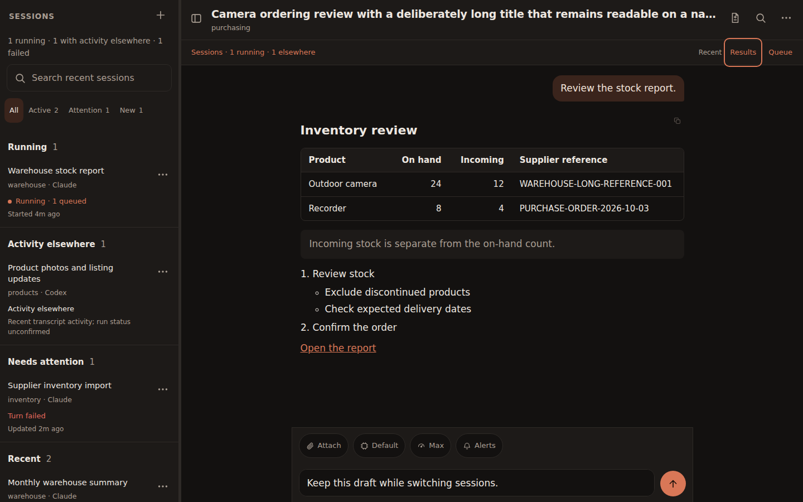
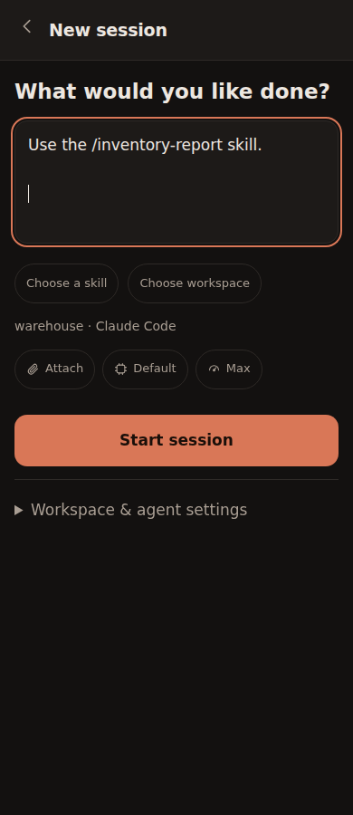

# Conversation workspace: 1.2

> Historical design and verification record. For current behavior, use the
> [workspace guide](workspace-guide.md). Do not use this record as an upgrade runbook.

Screenshots use synthetic data. Results links retain their existing access controls;
local files require session-bound authentication. Queue entries are separate saved
turns, with revision checks for edits and explicit review for uncertain starts.
The regression suite includes four viewport widths, unsafe Markdown, report access,
queue stop/restart/resume, failed-send recovery and reading-position restoration.

Real Claude and Codex checks confirmed native skill discovery, acknowledged steering,
and an edited follow-up dispatched once; a removed instruction was not executed.
Structured questions and approval cards remain future work. The installed runtimes
currently run unattended; this release does not present a fictional approval layer.
