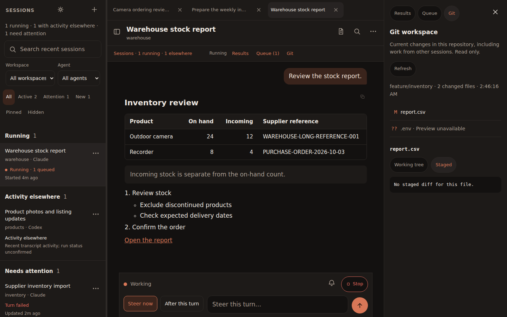
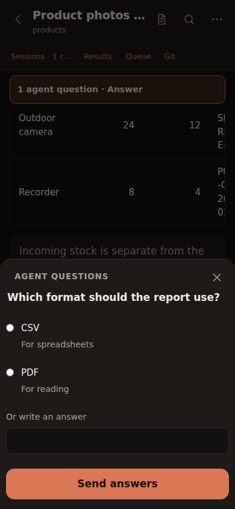

# Daily workspace: 1.3

Screenshots contain synthetic fixture data only.

On desktop, open sessions stay in a tab strip. Results, Queue and Git can remain
beside the conversation at wide window sizes. The same controls open focused
sheets on phones. Filters, hidden sessions, tabs, drafts and panel preference are
local to each browser; pinning, names, queues and conversations remain server data.
Hide is reversible, does not delete history, and does not hide active/waiting work.

Ctrl/Cmd K finds sessions; Ctrl/Cmd Shift L starts one; Alt [ and Alt ] switch open
tabs. Settings → Keyboard & workspace lists these. Resume returns to the last tab.

Claude questions use its native stream control protocol. Codex questions use the
app-server protocol and the new Plan first mode. Select Work normally when ready
to implement. Modes affect subsequent turns, including queued work; they do not
change an already-running turn. Plan mode is guidance, not a permissions sandbox.
Questions only apply to turns owned by Pocket Code; conversations running elsewhere
retain their existing external-activity indicator.

Question responses are connection-scoped and protected against duplicate replies.
Browser sleep/reload does not lose a pending server question. A daemon restart can
break the provider input connection: Claude surfaces an interrupted-question state
if its detached process survives, with a stop-and-resume action. Codex requests
expire with their owning turn/connection. Never replay an answer into a new turn.
No answer contents are put in Pocket's question notifications or browser storage.

Editing a queued instruction reserves it in the `editing` state. It cannot dispatch
until saved or canceled. If the running turn finishes during editing, save then use
Run next to resume the paused queue. Closing the panel leaves the reservation;
Continue editing recovers the local draft. Another device sees the server's paused
state, but not that unsaved local text. Revision checks reject concurrent stale edits.

Git is a read-only snapshot of the entire repository, including changes by other
sessions. It is not a claim that the selected agent made each change. Staged and
working-tree diffs are separate; untracked files are listed without a content preview.
Hidden/sensitive paths and symlink escapes cannot be previewed. Up to 250 changed
files and 256 KB per diff are shown. Session edits remains the older transcript view.

Accounts & instance queries `claude auth status --json` and Codex `account/read`,
returns only identity/plan metadata and never changes credentials. Existing runs
may retain earlier account configuration. MemStem remains an agent integration.

Validation includes unit/API tests, synthetic browsers at four widths, real Claude
and Codex question/answer turns, live candidate checks and the installed-app update
path. Employee permissions, physical mobile keyboards and screen readers need
separate operator validation before an employee pilot.

## Upgrade and rollback

Keep session metadata, delivery receipts, follow-up queue and turn logs. Deploy when
owned turns are idle, especially while a native question is open. When rolling back
to 1.2, first back up the current queue and convert any `editing` rows or Plan-mode queued rows to `uncertain`
(with an explanatory error and incremented revision) so older code can read them
without dispatching an unfinished edit. Do not restore an older runtime-data backup
over newer conversations or instructions.
