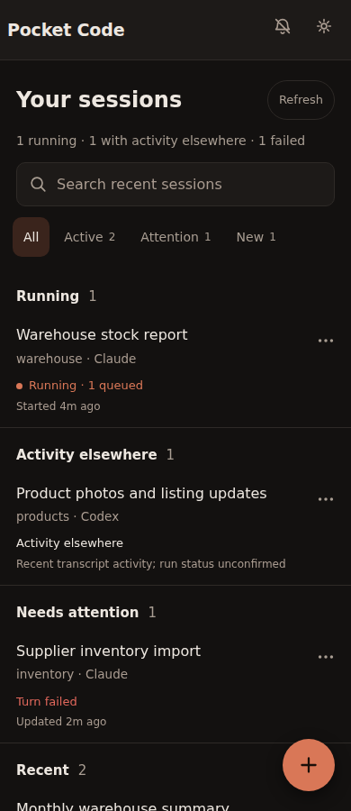
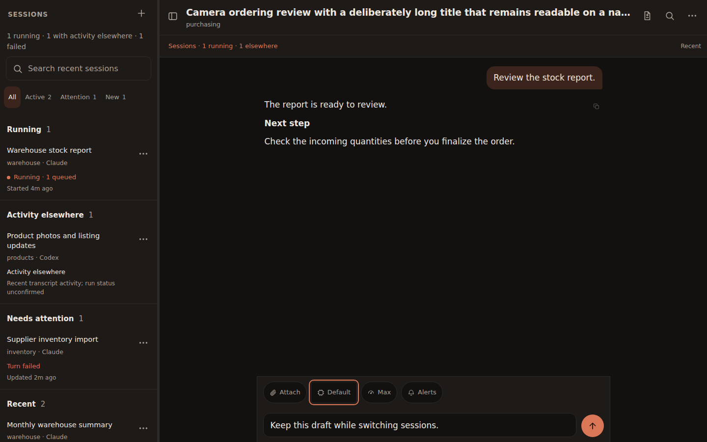

# Session workspace: 1.1 release candidate

The first increment focuses on finding active work and recovering messages when a
connection fails. It keeps the existing agent runners and transcript stores.

These screenshots use synthetic sessions and contain no private transcripts.

## Behavior

- Running means Pocket Code owns a live turn. Activity elsewhere means recent
  transcript activity; it cannot confirm that another process is still running.
- Response ready means a successful agent turn ended, not that its overall task is
  complete. New and Attention indicators are read markers on this device.
- The same search, groups and filters appear in the session home, desktop rail and
  mobile switcher. More menus expose pin/rename without a hidden gesture.
- Failed status refreshes retain the last list with explicit unavailable labels.
- An outgoing message stays saved until acknowledgment. Retry sends the same
  identifier. The server replays an existing receipt instead of dispatching again.
- If the server interrupted a request before recording its response, the interface
  requires conversation review. Discarding a retry does not cancel accepted work.

## Verification

Eight unit/API tests cover concurrent retries, changed-content conflicts, receipt
persistence after restart, ambiguous interruptions, storage failures, honest session
states, active-session limits and HTTP running/completion/failure transitions.

Browser fixtures pass at 360, 390, 768 and 1440px: no horizontal page overflow,
filters/counts, keyboard focus containment and restoration, preserved drafts and
attachments, stale status, and response-loss/reload recovery for both message sends
and new-session creation. Each recovery case dispatches once.

Source and rendered design scans were reviewed with mobile/desktop screenshots.
The scan reports intentional system fonts, compact app typography, title ellipsis,
and the existing slash-menu shadow. Paragraph edge warnings refer to padded boxes,
not text touching the viewport; the footnote has a bounded reading width. These are
reviewed exceptions, not a claim of zero automated findings.

Physical phones, software keyboards, assistive technology and real Claude/Codex
turns remain release checks. The API test uses a fake Claude executable; browser
fixtures include both providers. This change does not introduce employee isolation
or a new permissions model. See [the plan](../IMPLEMENTATION-PLAN.md) for later stages.
